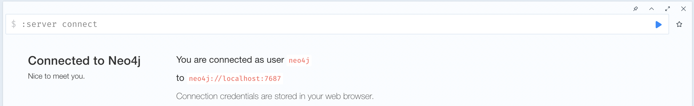
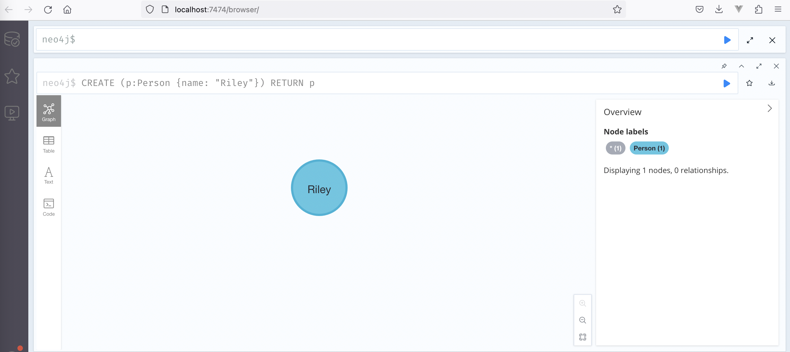
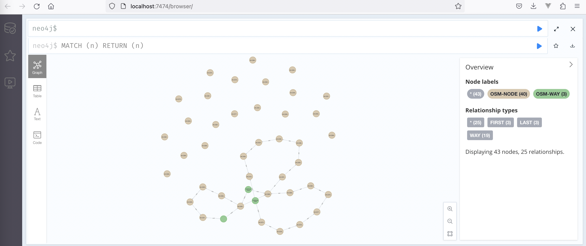
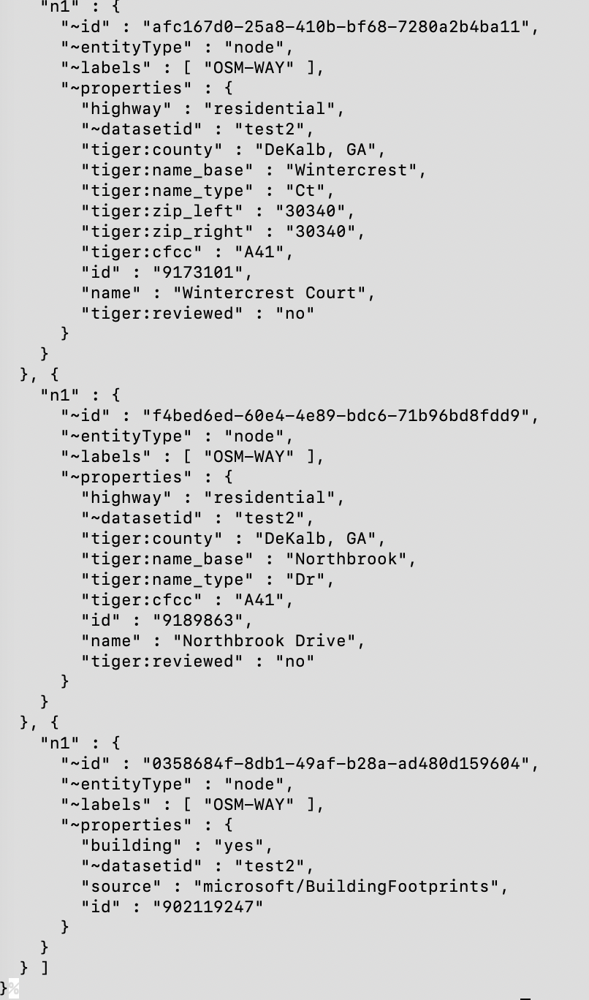

# ITS4US

ITS4US is a program aims to solve mobility challenges for all travelers with a specific focus on underserved communities, including people with physical or cognitive disabilities, older adults, low-income individuals, and LEP travelers. This program seeks to enable communities to build local partnerships, develop and deploy integrated and replicable mobility solutions to achieve complete trips for all travelers.

## Installing / Getting Started - AWS
### Setting up AWS

There are 4 different AWS services used in this project: Neptune, Lambda, S3, API Gateway, and EventBridge.

An AWS VPC must also be used that contains the Neptune database. Follow the directions to set up the NAT gateway and subnets: [How to setup AWS lambda function to talk to the internet and VPC](https://gist.github.com/reggi/dc5f2620b7b4f515e68e46255ac042a7).

Using AWS Console > VPC:
  1. Create a VPC. The Neptune database will be inside this VPC. Note the VPC CIDR for later use.
  2. Create subnets with unique CIDRs: 1 that will point to the IGW, and 2-3 that will point to the NAT.
  3. Create a NAT gateway that uses the IGW subnet.
  4. Create an Internet Gateway.
  5. Create two route tables:
        One that points to the NAT:

        Destination|Target
        ---|---
        `<VPC CIDR>` | local 
        0.0.0.0/0 | nat-█████████████████

        One that points to the IGW:

        Destination|Target
        ---|---
        `<VPC CIDR>` | local 
        0.0.0.0/0 | igw-████████
  6. Update each subnet to use the appropriate route table.

From now on each Lambda function created needs to be set to use the VPC and NAT subnets (not the IGW subnet).

### Setup - Neptune

Information on setting up a Neptune database using the AWS Console can be found here: [Launching a Neptune DB cluster using the AWS Management Console](https://docs.aws.amazon.com/neptune/latest/userguide/manage-console-launch-console.html). Make sure the database is created inside the VPC.
Once created, note the database url found in Connectivity & Security > Endpoints to be used later.

### Setup - Lambda

The `aws_lambda` folder contains many different lambda functions used in this project, each with a `deployment_package.zip` (a compressed zip file of the contents in the folder). 

For each lambda function:
1. Use the AWS Console to create a lambda function. Make sure to set the VPC and NAT subnets in the 'Advanced Settings'.
2. Upload the function using Code > Upload from > .zip file, and select the appropriate `deployment_package.zip`.

### Setup - S3

S3 to used to store certain data. 5 buckets must be created:
1. Used for bulk load to neptune.
2. Used for Navigator data.
3. Used for Sidewalk data.
4. Used for Waze data.
5. Used for public access.

### Setup - API Gateway

The file `oas30-apigateway.json` contains an OpenAPI configuration with API Gateway extensions, that can be directly imported into API Gateway by navigating to AWS Console > API Gateway > Create API > REST API > Import.

Once created, deploy the API and then set the stage variables:

        Name|Value
        ---|---
        env | `<env-name>`
        LOAD_BUCKET | `<bulk-load-bucket-name>`
        NAVIGATOR_BUCKET | `<navigator-bucket-name>`
        SIDEWALK_BUCKET	| `<sidewalk-bucket-name>`
        WAZE_BUCKET | `<waze-bucket-name>`
        PUBLIC_BUCKET | `<public-bucket-name>`
        LOADER_URL | `https://<database-endpoint>:8182/loader>`
        QUERY_URL | `bolt://<database-endpoint>:8182`
        READ_PERM | `<read-only-password>`
        WRITE_PERM | `<read-write-password>`

### Setup - EventBridge

Certain functions are set to activate in routine intervals.
Using AWS Console > Amazon EventBridge, one can create a rule or schedule that can activate a lambda function at a fixed rate or be triggered by an event.

##  Working with AWS Lambda Functions

For OpenStreetMap (OSM) data, a AWS Lambda function called `importOSMBulkLoad` is created to *POST* or *DELETE* data to/from the AWS Neptune database.

AWS Lambda function such as `importOSMBulkLoad` is run by uploading the codebase in a zip file. If necessary, perform the following steps to deploy another version of the codebase for the Lambda function:

1. If necessary, modify `aws_lambda/<action_datatype>/lambda_function.py`, where <action_datatype> is the action and the type of data you are currently working on
2. If necessary, unzip the `aws_lambda/<action_datatype>/deployment_package` package and add additional libraries or scripts needed to the unzipped package folder. Note that the package name may vary
3. Zip the deployment package with the installed libraries and needed scripts at root level: 
        
        $ cd aws_lambda/<action_datatype>/deployment_package
        $ zip -r ../deployment_package.zip .
4. Add the modified `aws_lambda/<action_datatype>/lambda_function.py` file to the zipped package:

        $ cd ..
        $ zip deployment_package.zip lambda_function.py
5. Upload the modified package `deployment_package.zip` to AWS Lambda using its console:
        
    a. Navigate to the AWS Lambda function (e.g.`importOSMBulkLoad`), or create a new function if needed.
    
    b. Under the Code source section, choose `Upload from` > `.zip file`

For more information on uploading a zip codebase file for AWS Lambda function, visit [Working with .zip file archives for Python Lambda functions](https://docs.aws.amazon.com/lambda/latest/dg/python-package.html).

##  Working with API Gateway

Lambda functions are activated using API Gateway to route http requests to a lambda function. API Gateway provides authorization and data routing for the lambda functions. The API Gateway also holds stage variables that indicate which database URL to use for a given stage.

Here is an example call to API Gateway to activate the OSM import function:

        curl -v -X POST 'https://<api-id>.execute-api.<aws-region>.amazonaws.com/<stage>/api/osm/import?bbox=-84.2400300,33.8787100,-84.2370600,33.8805000&id=test-x' -H 'Content-Type: application/json' -H 'Authorization:<password>'

where `api-id` is the ID for the API Gateway, `aws-region` is the region where the API Gateway was created, and `stage` is the stage of the deployed API Gateway.

Here is an example of *DELETE* request, where OSM nodes on the Neptune database are deleted based on the input parameter `id` which is stored as a node property called `datasetid` for the OSM data:

        curl -v -X DELETE 'https://<api-id>.execute-api.<aws-region>.amazonaws.com/<stage>/api/osm?id=test-x' -H 'Content-Type: application/json' -H 'Authorization:<password>'

## Installing / Getting Started - Local
### Prerequisites

  - Install [Miniconda](https://conda.io/projects/conda/en/latest/glossary.html#miniconda-glossary) or [Anaconda](https://www.anaconda.com/) for the `conda` commands
    - Follow the installation guide here to install: https://conda.io/projects/conda/en/latest/user-guide/install/index.html
    - Note: It is recommended to install [Miniconda](https://conda.io/projects/conda/en/latest/glossary.html#miniconda-glossary) with the link above instead of [Anaconda](https://www.anaconda.com/) if you did not already have [Anaconda](https://www.anaconda.com/) installed
  - Install [Git](https://git-scm.com/book/en/v2/Getting-Started-Installing-Git) to clone Github repositories

### Create the `its4us` virtual environment

Follow the steps to create the `its4us` env:

  1. Open a new terminal, run `conda create -n its4us python=3.10`
  2. Run `conda env list` to verify that the new environment was installed
  3. Run `conda activate its4us` to activate the `its4us` virtual environment
  4. Run `pip3 install -r requirements.txt` to install necessary libraries for the environment
  5. Run `conda deactivate` to deactivate the `its4us` virtual environment
  6. Ensure the virtual environment is now `base` on the terminal

  NOTE: To update the `its4us` virtual environment when there is a change in the `requirements.txt` file, run `pip3 install --upgrade -r requirements.txt` on the `its4us` environment to update.

## Install and start a local Neo4j server

1. Install Neo4j locally
    1. Navigate to [Neo4j Installation](https://neo4j.com/docs/operations-manual/current/installation/) page to install Neo4j for either Linux, macOX or Windows
    2. Follow the steps on the installation page to download Neo4j
    3. On the [Neo4j Download Center](https://neo4j.com/deployment-center/#gdb-tab) page, choose Community Edition version of Neo4j to install from the "Graph Database Self-Managed" section
2. As mentioned from the Neo4j installation steps, start Neo4j console by running:

        <NEO4J_HOME>/bin/neo4j console

    where `<NEO4J_HOME>` is the top level directory where the downloaded Neo4j files are located.
3. Open http://localhost:7474 on the web browser
4. Connect using the username `neo4j` with the default password `neo4j`, and change the defaulted password at the prompt
5. On the Neo4j browser, make sure the following screenshot is shown:

      

## Test Neo4j local server

1. Follow the steps above to install Neo4j server locally and open the neo4j console at http://localhost:7474 on a web browser 
2. Create a Person node on the web browser by running the following:

        CREATE (p:Person {name: "Riley"}) RETURN p
3. Make sure the node is created as shown:

      
4. Run the following code to make sure the Person node from previous step is returned:

        MATCH (n) RETURN (n)
5. Delete the node:

        MATCH (n) DETACH DELETE (n)
6. Make sure the following log is displayed to make sure the node is deleted:

      `Deleted 1 node, completed after 1 ms.`

More on Neo4j openCypher queries: 
* [Neo4j Cypher Manual](https://neo4j.com/docs/cypher-manual/current/introduction/)
* [Neo4j Cypher Queries](https://neo4j.com/docs/getting-started/cypher-intro/)

## Test Neo4j queries in Python with local server

To test the OpenStreetMap (OSM) parser [osm_sax_python.py](https://git2.icl.gtri.org/projects/ITS4US/repos/general/browse/parser/osm/sax_python/osm_sax_python.py) and the openCypher queries on [query_writer.py](https://git2.icl.gtri.org/projects/ITS4US/repos/general/browse/parser/osm/sax_python/query_writer.py), a small test file [test.osm](https://git2.icl.gtri.org/projects/ITS4US/repos/general/browse/parser/osm/sax_python/test.osm) is used, and the Neo4j local server that is set up from above could be used to test the code locally using [driver.py](https://git2.icl.gtri.org/projects/ITS4US/repos/general/browse/parser/osm/sax_python/driver.py):

0. Make sure Neo4j local server is installed and running by following the steps in the "Install and start a local Neo4j server" section above
1. Run `conda activate its4us`
2. Run the following line to add nodes and links from the test file [test.osm](https://git2.icl.gtri.org/projects/ITS4US/repos/general/browse/parser/osm/sax_python/test.osm) to the `neo4j` local database:

        python3 /<root_directory>/parser/osm/sax_python/driver.py local test.osm test1 -u neo4j -p <password>

    where `<root_directory>` is the root directory of the repo and `<password>` is the password set when the local neo4j server was installed
4. Navigate to http://localhost:7474 and running the following line on the console:

        MATCH (n) RETURN (n)
5. Make sure there are total of 43 nodes created and shown, where 40 of these are node type and the remaining 3 are way type:

   

## Connect to AWS Neptune database from local

With a Neptune Database initialized, follow the AWS documentation to set up an EC2 proxy and SSH tunnel: [Connecting graph notebook locally to Amazon Neptune (first-time setup)](https://github.com/aws/graph-notebook/tree/main/additional-databases/neptune). The following steps will explain how to set the connection to the database from local machines:

1. Follow step 1 of [Part 2: Set up an SSH tunnel](https://github.com/aws/graph-notebook/tree/main/additional-databases/neptune#part-2-set-up-an-ssh-tunnel) in the [Neptune README](https://github.com/aws/graph-notebook/blob/main/additional-databases/neptune/README.md) to add the lines to the `/etc/hosts` file on the local machine:

        127.0.0.1   localhost   <database-name.endpoint>.<region>.neptune.amazonaws.com

2. Create a new key pair and add the generated public key to the EC2 instance:

    1. Based on the AWS documentation on [adding a key pair](https://docs.aws.amazon.com/AWSEC2/latest/UserGuide/replacing-key-pair.html), follow the [steps here](https://docs.aws.amazon.com/AWSEC2/latest/UserGuide/create-key-pairs.html#having-ec2-create-your-key-pair) to create a new key pair using Amazon EC2 Console. Store the private key file that is generated somewhere on the local machine (e.g.`</path/to/private_key.pem>`)
    2. Retrieve the public key from the new key pair using the [Retrieve the public key material](https://docs.aws.amazon.com/AWSEC2/latest/UserGuide/describe-keys.html#retrieving-the-public-key) page. Record the public key shown for the next step
    3. On a browser, connect to the EC2 instance using the public IP.
    4. On the EC2 Console page, run `vi ~/.ssh/authorized_keys` to add the public key shown from step 2 to the `authorized_keys` file. Leave the existing public keys in the file there. Save the file.
    5. Close the EC2 Console page
3. Open a Terminal and run the following line to check the connection to EC2:

        ssh -vvv -i </path/to/private_key.pem> ec2-user@ec2-<ip-address-dashed>.<region>.compute.amazonaws.com
4. Make sure the Terminal is now in the EC2 Console starting with the username `ec2-user`. 

5. Open another Terminal and run the following line to connect to the Neptune database:
        
        $ssh -vvv -i </path/to/private_key.pem> ec2-user@ec2-<ip-address-dashed>.<region>.compute.amazonaws.com -N -L 8182:<database-name.endpoint>.<region>.neptune.amazonaws.com:8182

6. Navigate to https://<database-name.endpoint>.<region>.neptune.amazonaws.com:8182/status for database in a browser to check the connection and make sure the status is "healthy".

## Add nodes to AWS Neptune database from local

With the connection set up by following the steps in the section above, nodes such as OSM nodes can be added to the AWS Neptune database by running [driver.py](https://git2.icl.gtri.org/projects/ITS4US/repos/general/browse/parser/osm/sax_python/driver.py) locally:

1. Open a new Terminal and run `conda activate its4us`
2. Execute the script `driver.py` in the repo to add some nodes to the database for testing purposes: 

        python3 /<root_directory>/parser/osm/sax_python/driver.py aws test.osm test1

    where `<root_directory>` is the root directory of the repo

3. Make sure the script runs successfully without errors
4. Open another Terminal and run 
        
        curl HTTPS://<database-name.endpoint>.<region>.neptune.amazonaws.com:8182/openCypher -d "query=MATCH (n1) RETURN n1;"
5. Make sure the nodes are displayed on the Terminal, where the following image is a snippet of the output: 

      

The query portion could be modified to run other openCypher queries.

##  Access AWS Neptune database from local using Jupyter Notebook

AWS Neptune database data can be accessed locally using Jupyter Notebook. Based on the instructions from [AWS graph-notebook](https://github.com/aws/graph-notebook), follow the steps to set up and acess the data:

1. First, open a terminal and install the required libraries:

        conda activate its4us
        pip3 install --upgrade -r requirements.txt

2. Copy existing Jupyter notebooks provided by AWS to the local instance:

        python -m graph_notebook.notebooks.install --destination ~/notebook/destination/dir
3. Start jupyterlab:

        python -m graph_notebook.start_jupyterlab --jupyter-dir ~/notebook/destination/dir
        
    where Jupyter Notebook will open in a browser
4. Make sure the connection to AWS Neptune database is set up locally from the "Connect to AWS Neptune database from local" section above, where the database status URL returns healthy status. Leave the connection open and running from step 6 of the section.
5. Go back to the Jupyter Notebook on the browser and create a new notebook
6. Add the following lines to the first cell in the notebook to configure the dev database connection:

        %%graph_notebook_config
        {
          "host": "<database-name.endpoint>.<region>.neptune.amazonaws.com",
          "port": 8182,
          "auth_mode": "DEFAULT",
          "load_from_s3_arn": "",
          "ssl": true,
          "ssl_verify": true,
          "aws_region": "<region>"
        }

7. Run the cell
8. Add and run a test query to another cell to make sure the connection is successful:

        %%oc bolt

        MATCH (n)
        RETURN (n)
        LIMIT 10
   where first 10 nodes from the Neptune database are returned

For more information, visit [AWS graph-notebook](https://github.com/aws/graph-notebook).

##  Impedance API

To import impedance data to the Neptune `<stage>` database, bulk load is used from AWS. First run the following command to upload the input CSV file to an AWS S3 bucket:

        curl -v -X PUT 'https://<api-id>.execute-api.<region>.amazonaws.com/<stage>/<bucket>/<filename>.csv' -H 'Content-Type: text/csv' -H 'Authorization:<password>' --data-binary "@</path/to/file.csv>"

  where `<filename>.csv` is the file that will be stored on S3 (e.g. `impedance.csv`), and `</path/to/file.csv>` is the local file path to be uploaded to S3.

Once the CSV file is uploaded to the S3 bucket S3 bucket, run the following curl command to test out *POST* request:

**POST request:**

        curl -v -X POST 'https://<api-id>.execute-api.<region>.amazonaws.com/<stage>/api/impedance/import?id=<id>&filename=<filename.csv>' -H 'Authorization: <password>' -H 'Content-Type: application/json'

where `<id>` is the id input and `<filename.csv>` is the CSV file stored on the S3 bucket from the initial command above.

To export impedance data from the Neptune <stage> database, the following curl command can be used, using the appropriate `<id>`:

**GET request:**

        curl -v -X GET 'https://<api-id>.execute-api.<region>.amazonaws.com/<stage>/api/impedance/import?id=<id>' -H 'Authorization: <password>' --output <outfile.csv>

where `<id>` could be one of the following grid cell names in the study area:

* 34.0N84.4W
* 33.8N84.4W
* 33.9N84.4W
* 33.8N84.1W
* 34.0N84.3W
* 33.8N84.3W
* 33.9N84.3W
* 33.8N84.2W
* 33.9N84.2W
* 34.0N84.2W
* 33.9N84.1W
* 34.0N84.1W
* 33.9N84.0W
* 34.0N84.0W

indicating southwest corner of the 0.1 x 0.1 degree grid cells, or `area-1` for the entire study area. `<outfile.csv>` is the output CSV file storing the impedance links found in the search area requested. If a search area is not found from the input `<id>`, `<id>` input is used as the `__datasetid` field to search for the impedance links.

**Impedance Calculation**

The API can calculate and add impedance values to the database using the following request:

        curl -v -X POST 'https://<api-id>.execute-api.<region>.amazonaws.com/<stage>/api/impedance/calculate?id=<id>' -H 'Authorization: <password>'

Currently the calculation combines fixed data on the path lengths with impedance factors from Waze alerts to calculate the impedance values between OSM nodes.

##  Waze Data API

APIs are set up from AWS to upload Waze alerts data to a AWS S3 bucket `<waze-bucket>` as json files, as well as waze node and relationships ingestions to the AWS Neptune database. The json files are saved as `<name>-YYYY-MM-DD-HHMMSS.json` files, where `<name>` is the coordinates of the polygon study area where the Waze alerts data was retrieved. The json files could be deleted from the S3 bucket `<waze-bucket>` using an API as well.

Currently two AWS Lambda Functions are set up for the Waze alerts data: 

1. `import-waze-s3`: allows the following APIs to perform *POST* and *DELETE* using `curl` manually by user:
        
        curl -v -X POST 'https://<api-id>.execute-api.<region>.amazonaws.com/<stage>/api/waze-alerts/import' -d '{"id":"<id>"}' -H 'Content-Type:application/json' -H 'Authorization:<password>'

   Waze alerts data will be uploaded to `single-run/<id>-<YYYY-MM-DD-HHMMSS>.json` in the `<waze-bucket>` S3 bucket, where `<id>` is one of the grid cell names for the study area. Waze nodes and relationships are also ingested to AWS Neptune `<stage>` database.

        curl -v -X DELETE 'https://<api-id>.execute-api.<region>.amazonaws.com/<stage>/api/waze-alerts' -d '{"id":"<id>"}' -H 'Content-Type:application/json' -H 'Authorization:<password>'

   Waze nodes and associated relationships are deleted from AWS Neptune `<stage>` database if waze nodes have not been updated for more than 15 minutes.

   **NOTE:** When the above POST is run, an message "Endpoint request timed out" may appear after few seconds as the default timeout value on AWS API-GATEWAY is 29 seconds (currently there is no option to change the value). The run nevertheless continues at background and the waze ingestions are being made to completion. To verify, navigate to **AWS CloudWatch > Log groups > /aws/lambda/import-waze-s3** to view the lastest log generated by the run, where a message "Whole process is completed for the request: POST" should appear once the run is completed.

2. `import-waze-s3-scheduled`: works with AWS EventBridge schedulers named `waze-scheduler-<id>` to execute *POST* request automatically every minute when enabled. Waze alerts data in json files will be uploaded to `scheduler-<YYYY-MM-DD>/<id>-<YYYY-MM-DD-HHMMSS>.json` in the `<waze-bucket>` S3 bucket, where `<id>` is one of the grid cell names for the study area, and Waze data are ingested to the AWS Neptune `<stage>` database as nodes and relationships.

   To enable the scheduler: 
         
   1. Navigate to Amazon EventBridge Service
   2. On the left hand panel, click on `Schedules` under the `Scheduler` section
   3. Scroll down to the bottom page of the `Schedules` and click on a `waze-scheduler-<id>` scheduler
   4. Click on `Enable` on the top right hand corner of the page
   5. Confirm to enable the schedule on the pop-up window
        * Waze alerts data will be uploaded to `<waze-bucket>` S3 bucket as json files
        * Waze alerts nodes and relationships are ingested to AWS Neptune <stage> database

   To disable the scheduler: 
   1. Click on `Disable` on the top right hand corner of the page
   2. Confirm to disable the schedule on the pop-up window
        * Waze alerts data are paused to be uploaded to `<waze-bucket>` S3 bucket as json files
        * Waze alerts nodes and relationships are paused to be ingested to AWS Neptune <stage> database

   A scheduler called `waze-scheduler-delete` is also created to delete Waze nodes and attachments that are 15 minutes older or have not been modified for the last 15 minutes in the Neptune <stage> database.

##  NaviGAtor Scheduled and Unscheduled Events Data API

APIs are set up on AWS to ingest NaviGAtor scheduled and unscheduled events data from CSV files stored on the AWS S3 bucket `<navigator-bucket>` to the AWS Neptune database. The CSV files are uploaded to the S3 bucket every 5 minutes by Windows taskers on a server hosted by Georgia Tech Civil Engineering (GT/CE) Department.
The CSV filenames have the following formats:

* `scheduled_event_<YYYYMMDD>T<HHMM>.csv`: contains NaviGAtor scheduled events
* `unscheduled_event_<YYYYMMDD>T<HHMM>.csv`: contains NaviGAtor unscheduled events
* `event_comment_<YYYYMMDD>T<HHMM>.csv`: contains comments for a set of events
* `event_property_<YYYYMMDD>T<HH>.csv`: contains properties for a set of events

Currently two AWS Lambda Functions are set up for the NaviGAtor events data: 

1. `import-navigator-events`: allows the following APIs to perform *POST* and *DELETE* using `curl` manually by user:

        curl -v -X POST 'https://<api-id>.execute-api.<region>.amazonaws.com/<stage>/api/navigator-events/import' -d '{"id":"<id>"}' -H 'Content-Type:application/json' -H 'Authorization:<password>'

   NaviGAtor events data from the latest CSV files on the S3 bucket will be processed and ingested to AWS Neptune <stage> database as nodes and relationships for the input `<id>`, where `<id>` is one of the grid cell names.

        curl -v -X DELETE 'https://<api-id>.execute-api.<region>.amazonaws.com/<stage>/api/navigator-events' -d '{"id":"<id>"}' -H 'Content-Type:application/json' -H 'Authorization:<password>'

   NaviGAtor event nodes and the associated relationships are deleted from AWS Neptune <stage> database if the event nodes have not been updated or modified for more than 15 minutes.

2. `import-navigator-events-scheduled`: works with AWS EventBridge schedulers named `navigator-scheduler-<id>` to execute *POST* request automatically every 5 minutes when enabled. The NaviGAtor scheduled and unscheduled events data from the latest CSV files on the S3 bucket will be processed and ingested to AWS Neptune <stage> database as nodes and relationships for the input `<id>`, where `<id>` is one of the grid cell names.

   To enable the scheduler: 
         
   1. Navigate to Amazon EventBridge Service
   2. On the left hand panel, click on `Schedules` under the `Scheduler` section
   3. Scroll down to the bottom page of the `Schedules` and click on a `navigator-scheduler-<id>` scheduler
   4. Click on `Enable` on the top right hand corner of the page
   5. Confirm to enable the schedule on the pop-up window
        * NaviGAtor scheduled and unscheduled events nodes and relationships are ingested to AWS Neptune <stage> database

   To disable the scheduler: 
   1. Click on `Disable` on the top right hand corner of the page
   2. Confirm to disable the schedule on the pop-up window
        * NaviGAtor scheduled and unscheduled events nodes and relationships are paused to be ingested to AWS Neptune <stage> database

   A scheduler called `navigator-scheduler-delete` is also created to delete NaviGAtor event nodes and relationships that are 15 minutes older or have not been modified for the last 15 minutes in the Neptune <stage> database.

##  STM Performance Metric Data (PMD) Calculations API

STM-based performance metrics are computed from the data on GMAP mobile application in JSON file format that are uploaded to AWS S3 bucket `<TBD>` on weekly basis. The following metrics are currently calculated from the AWS Lambda function called `calculate-performance-metrics` on each day of the requested week:

* Unique users count
* Trips requested count
* Completed trips count
* Abandoned trips count
* Trips deviated count
* Trips deviated at intersections count
* Fixed transit used count
* Aggregated or average counts of above metrics for past 7 days from the current day

The resulting metrics are saved to a JSON file called `PMD_<YYYY-MM-DD>_<YYYY-MM-DD>.json` for the requested week range starting on a Monday and ending on a Sunday. The file is then uploaded to the public S3 bucket for file access.

UPDATED on 08/23/24:
Currently only the aggregated metrics are saved and uploaded to the S3 bucket inside a json file named Weekly_PMD.json, and individual metric on each day is not saved. For example, the following json contains the aggregated metrics for two weeks of PMD data:

        [{"date": "2024-04-29_2024-05-05", "total trips requested": 21, "average unique users": 5.0, "total trips completed": 14, "total trips abandoned": 7, "average trips deviated": 3.0, "average trips deviated at intersection": 1.0, "average fixed transit used": 0.0},
        {"date": "2024-05-06_2024-05-12", "total trips requested": 22, "average unique users": 10.0, "total trips completed": 12, "total trips abandoned": 10, "average trips deviated": 5.0, "average trips deviated at intersection": 2.0, "average fixed transit used": 3.0}]

To run the computation manually, a *POST* API is set up as follows:

        curl -v -X POST 'https://<api-id>.execute-api.<region>.amazonaws.com/<stage>/api/pmd/calculate' -H 'Content-Type:application/json' -H 'Authorization:<password>'

where the PMD metrics are computed based on last week's data of the current run day. The optional parameter `week` can be specified by users as follows:

        curl -v -X POST 'https://<api-id>.execute-api.<region>.amazonaws.com/<stage>/api/pmd/calculate?week=20240429' -H 'Content-Type:application/json' -H 'Authorization:<password>'

if users wished to compute the metrics based a certain week of the data in the past. The `week` value is assumed to be a Monday, but the current implementation could handle the value to be any day. If users accidentally specifies the value of the `week` that is in the future, PMD metrics will be computed based on last week's data of the current run day. 

During the computation if a day's data could not be found on the S3 bucket `<TBD>` for the PMD calculation, an exception handler handles the file not found error and continues the calculation for the remaining data. The computed metrics for the run may not be accurate and a warning message is recorded on the logs for the incident.

Note that only *POST* is currently supported.

A AWS EventBridge scheduler named `pmd-scheduler` is set up to execute the Lambda function `calculate-performance-metrics` on Monday at 1 am EST/EDT each week. It is assumed that the data from GMAP have been upload to S3 `<TBD>` by then to calculate the PMD metrics for the past week's performance.

##  SidewalkSim Data API

###  SidewalkSim Links API

The *PUT*, *POST* and *DELETE* request APIs are set up to upload/delete SidewalkSim Links data to the AWS Neptune `<stage>` database. 

To test out the API requests on *PUT* or *POST*, run the following request first to upload a CSV file to the AWS S3 bucket `<sidewalk-bucket>`:

        curl -v -X PUT 'https://<api-id>.execute-api.<region>.amazonaws.com/<stage>/<sidewalk-bucket>/<filename>.csv' -H 'Content-Type: text/csv' -H 'Authorization:<password>' --data-binary "@</path/to/file.csv>"

  where `<filename>.csv` is the file that will be stored on S3, and `</path/to/file.csv>` is the local file path to be uploaded to S3.

Once the CSV file is uploaded to the S3 bucket S3 bucket `<sidewalk-bucket>`, run the following curl command to test out *PUT* or *POST* request:

**PUT request:**

        curl -v -X PUT 'https://<api-id>.execute-api.<region>.amazonaws.com/<stage>/api/sidewalk/links/import' -d '{"id":"<id>", "filename":"<filename.csv>"}' -H 'Content-Type:application/json' -H 'Authorization:<password>'

**POST request:**

        curl -v -X POST 'https://<api-id>.execute-api.<region>.amazonaws.com/<stage>/api/sidewalk/links/import' -d '{"id":"<id>", "filename":"<filename.csv>"}' -H 'Content-Type:application/json' -H 'Authorization:<password>'

where `<id>` is the id input and `<filename.csv>` is the CSV file stored on the S3 bucket `<sidewalk-bucket>` from the initial command above of the *PUT* or *POST* request.

To test the *DELETE* request API, run the following command:

**DELETE request:**

        curl -v -X DELETE 'https://<api-id>.execute-api.<region>.amazonaws.com/<stage>/api/sidewalk/links' -d '{"id":"<id>"}' -H 'Content-Type:application/json' -H 'Authorization:<password>'

where `<id>` is the id input of the DELETE request.

##  AWS CodePipeline CI/CD Testing

###  How AWS CodePipeline Works

A Continuous Integration/Continuous Deployment (CI/CD) DevOps pipeline could be set up using AWS CodePipeline to test, build and run a Lambda function of interest as an end-to-end testing if required. A CodePipeline pipeline provides the following capabilities but not limited to:
* Automatically runs the CI/CD pipeline when a change is detected from codebase using AWS CodeCommit
* The pipeline could run unit tests and integration tests automatically. The pipeline execution fails and stops if a test fails
* Automatically uploads the changes in the AWS CodeCommit codebase to a Lambda function of interest if all tests pass
* Automatically runs an end-to-end testing on the Lambda function of interest to make sure the latest changes did not introduce errors on the function

###  AWS CodePipeline Set Up Steps to Build and Test a Lambda Function

A CI/CD pipeline could be set up using AWS CodePipeline. The steps below illustrate setting up a CI/CD pipeline for end-to-end testing a Lambda function of interest by automatically runs the pipeline after a code change and makes sure the change did not introduce errors on the Lambda function. Follow the steps to set up the Lambda function of interest accordingly, a AWS CodeCommit repository to automatically trigger the pipeline for a code change, a AWS CodeBuild project to build the Lambda function, a AWS CodePipeline to create a CI/CD pipeline, and a new AWS CodePipeline stage to run end-to-end testing of the Lambda function:

1. Set up the lambda function of interest to run on AWS CodePipeline
   1. Navigate to the lambda function of interest
   2. Create layers for the dependencies that the function require and add the layers for the function - ideally, all dependencies of the function will be treated as layers
   3. Add the policy called `codepipeline-lambda-exec-policy` to the execution role of the function
   4. Record the Runtime of the function, i.e., the Python version the function holds
2. Create or gather the necessary files to upload to a AWS CodeCommit repository

   1. lambda_function.py: Similar to the lambda_function.py on the `import-waze-s3` lambda function, 
      1. set up a "codepipeline" boto3 client
      2. Add `put_job_success()` and `put_job_failure()` functions
      3. In the `lambda_handler()`, add `try` and `except` to wrap the code and to handle error-catching
      4. Note that the inputs to the function from a AWS CodePipeline has the structure of `job_data = event["CodePipeline.job"]["data"]["actionConfiguration"]["configuration"]["UserParameters"]`, where `job_data` is loaded as a JSON string. For example, the following user input parameters are specified in the `import-waze-s3` CodePipeline stage `Run-Lambda-Function` on the `Lambda-Action`: `{"stageVariables":{"env":"<stage>"},"httpMethod":"POST","body":{"id":"34.0N84.4W"}}`. Modify the `lambda_handler()` as necessary to support the user input parameters from a AWS CodePipeline run. Use the `lambda_handler()`  for the `import-waze-s3` Lambda function as a reference
      5. Add `put_job_success()` and `put_job_failure()` function calls before runs are completed and status are returned. Use the `lambda_handler()`  for the `import-waze-s3` Lambda function as a reference
   2. Other written Python files that the lambda function needs to run
   3. `requirements.txt`: Add any dependencies required for the CodePipeline to run. Try reduce the number of dependencies here as much as possible to make the package light. Make sure the versions of the dependencies support the Python version on the lambda function of interest. For example `pytest==8.0.2`.
   4. `buildspec.yml`: Specify the commands or actions required for the CodePipeline to execute in the build stage of the pipeline. Use the `buildspec.yml` for the `import-waze-s3` Lambda function as a reference,
      1. Set the `version` to 0.2
      2. Set the `runtime-versions` of `python` to the same runtime of the lambda function recorded on step 1.3
      3. Install dependencies from the `requirements.txt`
      4. Create `deployment_package.zip`
      5. Update the lambda function code by uploading the `deployment_package.zip` to the lambda function of interest
3. Create a new AWS CodeCommit repository and upload the files specified above from step 2 to the repository
4. Create a new AWS CodeBuild project by navigating to CodeBuild > Build projects,
   1. Under the source provider, select AWS CodeCommit and choose the repository created from step 3 above
   2. Create a new service role for the build project
   3. Set up VPC similarly to the lambda function of interest if required
   4. Set up File system similarly to the lambda function of interest if required; give an unique Identifier
      * If File system is required, click on "Enable this flag if you want to build Docker images or want your builds to get elevated privileges"
   5. Under the Buildspec section, select to use the `buildspec.yml` in the source code root directory
   6. Enable CloudWatch logs
5. After the AWS CodeBuild project is created, add lambda service policy to the service role created from the CodeBuild project,
   1. From the CodeBuild project, click on the service role link to navigate to the service role’s policies under IAM
   2. In the policy name that starts with CodeBuildBasePolicy, add the lines from 16 to 32 of the `aws_codepipeline > import_waze > CodeBuildBasePolicy-import-waze-s3-codepipeline-<region>.json` to the policy. The json file is located on the ITS4US Bitbucket repository
   3. Change the lambda function name to the lambda function of interest on the "Resource" field of the policy
6. Create a new AWS CodePipeline pipeline by navigating to CodePipeline > Pipelines,
   1. Pipeline type V1 may be sufficient
   2. Create new service role for the pipeline
   3. For the source provider of the Source section, choose AWS CodeCommit and select the repository created from step 3 above
   4. For the build provider of the Build section, choose AWS CodeBuild and select the project created from step 4 above
   5. Skip deploy stage
   6. Review the pipeline and create the pipeline
7. After the pipeline is created, create a new stage to run the lambda function of interest for end-to-end testing,
   1. On the CodePipeline page of the pipeline just created, click on Edit on the top of the page
   2. After the Build stage of the pipeline, click on `+ Add stage` and give it a name
   3. Click `+ Add action group` on the new stage to add an action group
   4. Give a name for the Action and choose AWS Lambda for the Action provider
   5. Specify the Function name to the lambda function of interest
   6. At the User parameters portion, specify input parameters the lambda function needs to test the code in curly brackets. For example: `{"stageVariables":{"env":"<stage>"},"httpMethod":"POST","body":{"id":"34.0N84.4W"}}`
   7. Create more actions on the stage if required
   8. Click `Done` on the stage and `Save` on the top page of the pipeline to save the new stage and action(s) created
8. Click `Release change` on the top page of the pipeline to incorporate the new stage just added to the pipeline
9. The pipeline automatically re-run itself. Make sure every stage runs successfully on the pipeline

**NOTE:** The unit tests and integrations tests will be written separately as Python `.py` files and will be incorporated into the pipeline in the future for testing purposes.

**NOTE:** The CodePipeline `import-waze-s3` that is set up for the `import-waze-s3` Lambda function currently runs from manual executions of API calls such as: `curl -v -X POST 'https://<api-id>.execute-api.<region>.amazonaws.com/<stage>/api/waze-alerts/import' -d '{"id":"33.8N84.4W"}' -H 'Content-Type:application/json' -H 'Authorization:<password>'`. Any changes made to the code in the CodeCommit repository for the function will be reflected from the API calls. Waze AWS EventBridge schdulers use the codebase under a different Lambda function called `import-waze-s3-scheduled` which may be combined with the `import-waze-s3` Lambda function in the future for more streamlining the codebase on the schedulers.